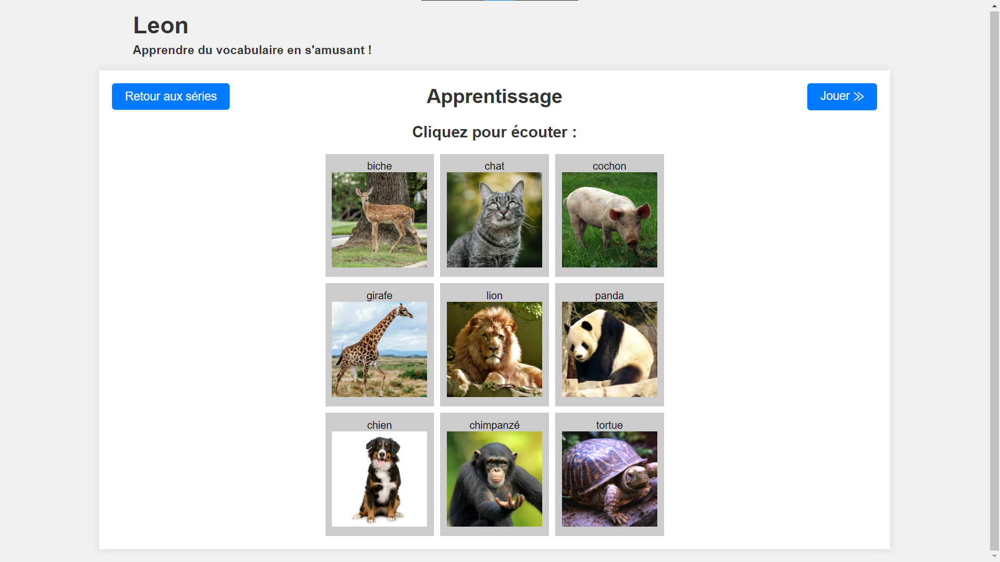

# Projet multimédia (Leon App)
- COLLIN Hugo
- LIM HOUN TCHEN Aimé
## Lancer le projet
- Installer `npm` https://nodejs.org/en
- Vérifier la bonne installation de `npm` avec la commande `npm -v`
- Exécuter à la racine du projet la commande d'installation des dépendances `npm install`
- Exécuter la commande `npm run start` pour lancer le serveur de développement
- Ouvrir le navigateur à l'adresse http://localhost:8080
## Capture d'écran du jeu avec les cartes

## Fonctionnalités
- Choix de la série de vocabulaire
- Ecouter la prononciation du mot correspondant à l'image
- Jouer à un jeu pour tester ses connaissances
- Réécouter la prononciation du mot en cliquant sur le bouton "Réécouter"
- Affichage d'un message score à la fin du jeu
- Contour des cartes en rouge si la réponse est fausse et en vert si la réponse est juste
- Possibilité d'ajouter des cartes dans la série de vocabulaire avec des fichiers json dans le répertoire assets/data
## Structure du projet
- Le répertoire assets contient les fichiers multimédias (images) utilisés dans le projet
- Le répertoire css contient les fichiers CSS utilisés dans le projet
- Le répertoire js contient les fichiers JavaScript utilisés dans le projet
### Structure du projet
#### Structure de données

La classe Picture est chargée de créer les images avec l'emplacement et le nom de l'image

La classe Cell représente une image sur laquelle l'utilisateur peut cliquer

La classe Grid représente la grille d'image avec une liste d'objets Cell

La classe GridGame et GridLearning sont des classes héritant de Grid et correspondant à la grille d'entraînement et celle de jeu

#### Structure de l'interface

La classe Page correspondant aux différentes pages que l'utilisateur peut voir

La classe PageGame et PageLearning héritent de Page et représentent les pages dédiées à l'apprentissage et au jeu

Il existe un seul document html dont les pages sont en display:none et affichées en fonction du nom du hash dans l'url du navigateur

#### Evénements

Au chargement de index.html, app.js est chargée d'initialiser les différentes pages et le routage qui permet à l'utilisateur de naviguer sur les différentes parties de l'application lorsqu'il clique sur un lien
